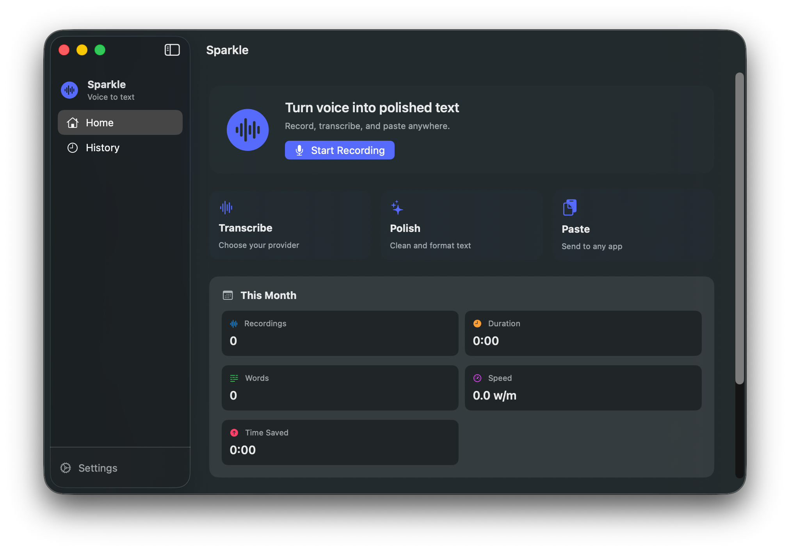

# Sparkle

Speak, get polished text in real time.



## Features

### Audio Recording
- Real-time waveform visualization while recording
- High-quality M4A audio

### Multiple STT Providers
- **OpenAI Whisper** - OpenAI's Whisper API
- **Deepgram** - Deepgram speech recognition API
- **AssemblyAI** - AssemblyAI transcription service
- **Custom API** - Any OpenAI-compatible endpoint

### LLM Text Polishing
- Polishes raw transcript using any OpenAI-compatible LLM
- Customizable system prompt
- Fixes grammar, punctuation, filler words, and repetitions

### Hotkey Controls
| Action | Trigger | Result |
|--------|---------|--------|
| Hold Recording | Hold `fn` | Record while held, stop on release |
| Hands-free Start | Double-press `fn` | Start continuous recording |
| Hands-free Start | `fn + Space` | Start continuous recording |
| Hands-free Stop | Press `fn` again | Complete recording |

### Menu Bar Integration
- Lives in the menu bar for quick access
- Recording status indicator with pulse animation
- Start/stop recording from the menu

### Recording History
- Browse and search past recordings
- View original transcript and polished text side by side
- Re-polish recordings with a different prompt

### Auto-Paste
- Copies result to clipboard
- Optional automatic paste at cursor position (simulates Cmd+V)

### Floating Widget
- Shows recording status with live waveform
- Cancel or complete recording with buttons
- Processing progress indicator

## Build & Run

```bash
# Open project in Xcode
open Sparkle.xcodeproj

# Build from command line
xcodebuild -project Sparkle.xcodeproj -scheme Sparkle -configuration Debug build

# Run the app
open ./build/Debug/Sparkle.app
```

## Configuration

1. Launch Sparkle
2. Open Settings (Cmd+,)
3. Configure API settings:
   - **STT Provider**: Select your preferred speech-to-text service
   - **STT API URL**: API endpoint (pre-filled for known providers)
   - **STT API Key**: Your API key for the selected provider
   - **LLM API URL**: OpenAI-compatible chat completions endpoint
   - **LLM API Key**: Your LLM API key
   - **LLM Model**: Model to use (default: gpt-4o-mini)
4. Customize the transcription prompt if needed
5. Enable/disable hotkeys and auto-paste

## Usage

1. **Start Recording**:
   - Hold the `fn` key to record while held
   - Double-tap `fn` or press `fn + Space` for hands-free recording
   - Click "Start Recording" in the menu bar

2. **Stop Recording**:
   - Release `fn` key (hold mode)
   - Press `fn` again (hands-free mode)
   - Click the checkmark on the floating widget

3. **Cancel Recording**:
   - Click the X button on the floating widget

4. **View Results**:
   - Text is automatically copied to clipboard
   - If auto-paste is enabled, text is pasted at cursor
   - View history in the main window
